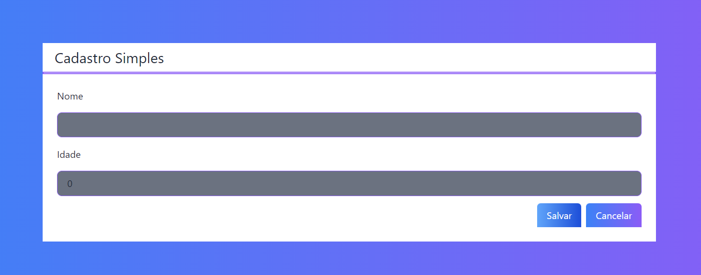

# Projeto em Next JS
<a href="https://next-crud-eosin.vercel.app/" target="_blank"> Ver projeto</a>

Objetivo: crud utilizando o firebase para armazenar os dados.

Configuração:

        npx create-next-app next-crud
        npm install -D tailwindcss@latest postcss@lates sutoprefixer@latest
        npx tailwindcss init -p

<a href="https://tailwindcss.com/docs/guides/nextjs">tailwindcss</a>

Dentro do arquivo tailwind.config.js coloque:

        module.exports = {
            purge: {
                content: [
                './src/pages/**/*.{js,ts,jsx,tsx}',
                './src/components/**/*.{js,ts,jsx,tsx}'
                ],
                safelist: [
                /^bg-/,
                /^to-/,
                /^from-/,
                ]
            },
            darkMode: false, // or 'media' or 'class'
            theme: {
                extend: {},
            },
            variants: {
                extend: {},
            },
            plugins: [],
        }
